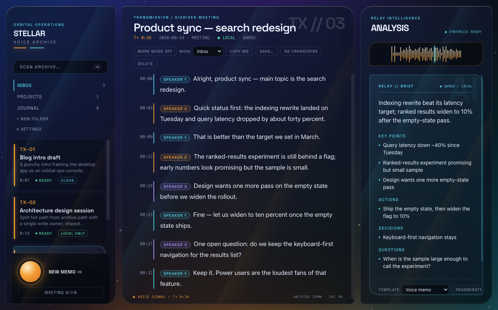
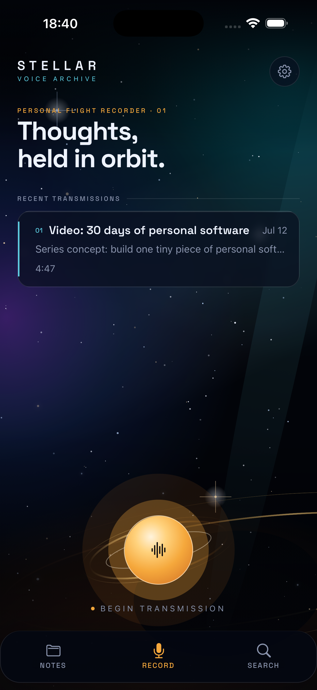
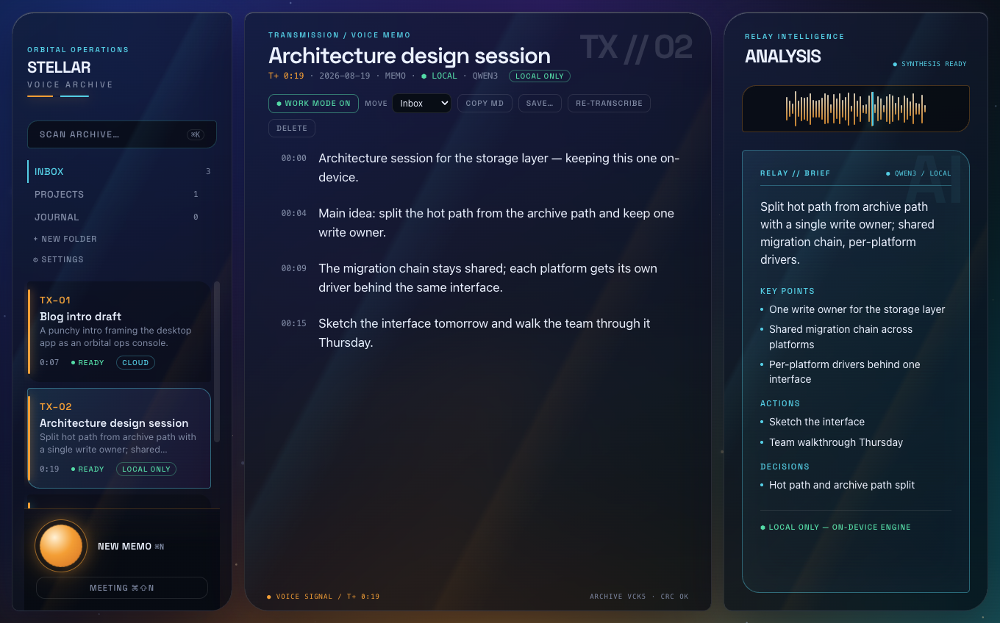
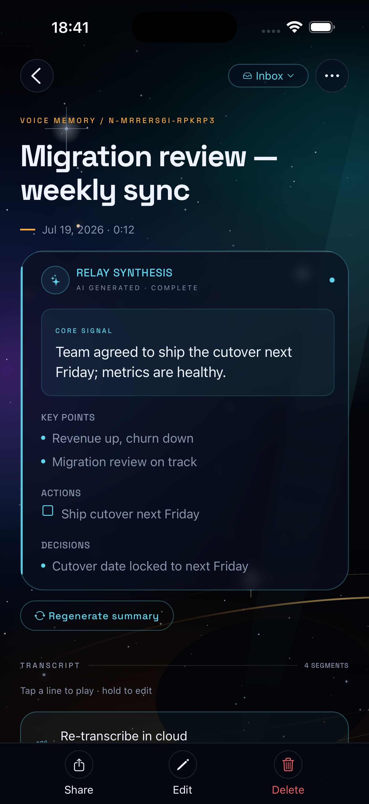
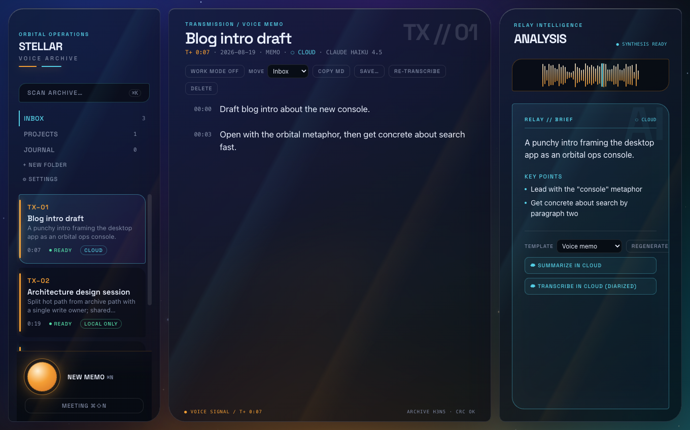

# Stellar Notes

**A privacy-first, cross-platform voice intelligence system.** Speech in →
searchable transcripts and structured summaries out — with sensitive
("work-mode") notes processed entirely on device, and cloud services available
only as explicit, per-note opt-ins.

Built and operated daily by its author as a replacement for dedicated
recording hardware and its subscription. Three platforms, one TypeScript core,
zero backend.

| | |
|---|---|
| **Platforms** | iOS · macOS · Windows |
| **Backend** | None — local-first architecture |
| **Search** | SQLite FTS5 over every spoken word, summary, decision, and open question |


*The desktop "orbital console": a diarized meeting transcript with speaker
labels, processed and summarized entirely on device.*



## Architecture

```
                    ┌──────────────────────────────┐
                    │   shared TypeScript core     │
                    │  notes · segments · speakers │
                    │  SQLite schema + migrations  │
                    │  summary schema & chunking   │
                    │  work-mode policy · search   │
                    └───────┬──────────┬───────────┘
                            │          │
        ┌───────────────────┤          ├────────────────────┐
        │ iOS (Expo/RN)     │          │ Desktop (Electron) │
        │                   │          │   macOS · Windows  │
        │ Apple Speech +    │          │ macOS: FluidAudio/ │
        │ SpeechAnalyzer    │          │  Parakeet ASR +    │
        │ (on-device ASR)   │          │  local speaker     │
        │ Foundation Models │          │  diarization (ANE) │
        │ (on-device        │          │ Windows:           │
        │  summaries)       │          │  whisper.cpp ASR   │
        │                   │          │ Ollama summaries   │
        └───────────────────┘          └────────────────────┘
```

Every platform speaks the same **StellarASR sidecar contract** — a stdio
JSON protocol (`{meta, utterances[], speakers[]}`) that let three different
ASR engines (Apple Neural Engine, CoreML/Parakeet, whisper.cpp) swap in
behind one interface, with shared timeout/kill/drain lifecycle handling and
strict shape validation at the trust boundary. See
[`samples/asrSidecar.ts`](samples/asrSidecar.ts).

## The privacy model

The interesting engineering constraint is the **work-mode boundary**: a
per-note hard switch guaranteeing that a sensitive note is never processed by
a cloud service.

- **Work mode ON** aborts any cloud call already in flight for that note,
  clears its cloud opt-in, and routes all future transcription and
  summarization on-device ([`samples/workModeToggle.ts`](samples/workModeToggle.ts)).
- On iOS, work-mode summaries run through Apple Foundation Models with a
  deliberate failure policy: a missing model or a generation error lands the
  note safely with no summary — never an error state wired to a cloud retry
  ([`samples/workModeSummary.ts`](samples/workModeSummary.ts)).
- On desktop, local processing is the **default** for all notes; cloud is
  per-note opt-in. Work-mode transcription was verified to make **zero
  outbound connections** (netstat-sampled during a packaged E2E run).
- Cloud credentials live in the OS keychain; the renderer never sees them.



## Structured summaries without a parser fight

Cloud summaries (OpenRouter) parse free-form model JSON behind a strict
parse-and-retry contract. On-device summaries use Apple **guided generation**
against a Zod schema that mirrors the cloud schema key-for-key — so
schema-valid output is enforced during decoding and the two paths accept
exactly the same shapes (a node test asserts the parity). See
[`samples/summarySchema.ts`](samples/summarySchema.ts).

## Screenshots

| iOS — structured summary | Desktop — diarized meeting |
|---|---|
|  |  |

Cloud is explicit, never implicit — a note that opted into cloud shows its
engine and model in the telemetry line:



All screenshots show seeded demo data from the project's evidence harness.

## Engineering notes

- **Shared schema, one migration chain** across React Native (expo-sqlite)
  and Electron (better-sqlite3) — the iOS suite stays green through every
  desktop schema change.
- **Speaker persistence** (macOS): diarization clusters carry L2-normalized
  centroid embeddings validated at the sidecar boundary (exact dimension,
  finite, non-zero norm; invalid centroids degrade gracefully, capped per
  note). Named speakers are recognized across meetings.
- **Sidecar lifecycle contract**: every native helper runs under a
  timeout/group-kill/drain wrapper, with progress-aware deadlines so a
  legitimate first-run model download isn't killed mid-fetch.
- **Import hardening**: DoS budgets, atomic persistence, and a summary-only
  fallback for malformed archives.
- **System-audio meeting capture** (macOS): microphone + system loopback
  mixed in-renderer into one recording, so both sides of a Mac-based call are
  transcribed. Degrades gracefully to mic-only — with a visible "MIC ONLY"
  chip — when loopback can't be acquired, and detects the granted-but-silent
  permission case rather than recording nothing.
- **Adaptive speaker-count diarization**: no fixed clustering threshold works
  across meeting-room and call audio, so the sidecar walks a descending
  threshold ladder until a minimum speaker count is met (a meeting is never
  one person), then merges down when the user pins an exact count.
- **Deterministic quality gate + versioned builds**: committed lint config
  (warnings fail), a single `verify` gate (lint + both test suites +
  typecheck) wired to pre-push, and every build stamped with its git commit
  and build date — shown in About and Settings, so a running copy can always
  be traced to the exact tree that produced it.
- Windows port implemented against the same contracts — platform-branched
  process handling (tree-kill semantics, platform-aware hotkey defaults) with
  the full test suite green on Windows.

## About this repository

This is a curated public window into a private project: the full source,
history, and operational documentation stay private (consistent with the
product's own privacy-first doctrine). The samples here are real, unmodified
files from the codebase, chosen to show the load-bearing design decisions.
Full source available on request.

Third-party engines used at runtime: [FluidAudio](https://github.com/FluidInference/FluidAudio)
(Apache-2.0), [whisper.cpp](https://github.com/ggml-org/whisper.cpp) (MIT),
[Ollama](https://ollama.com). The app is not affiliated with any of them.
